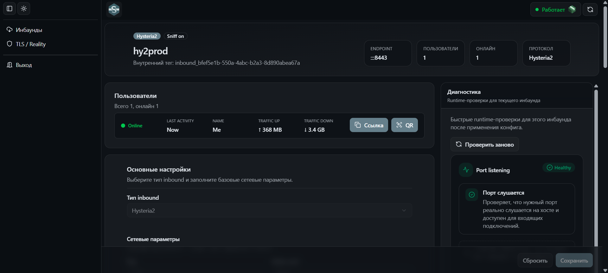

# sing-box-ui

Веб-панель для управления `sing-box` через UI без ручного редактирования runtime JSON.

Сейчас проект сфокусирован на понятных прикладных сценариях:

- управление `inbounds`
- редактирование параметров через формы с валидацией
- просмотр деталей инбаунда и runtime-диагностики
- генерация клиентских ссылок и QR
- работа с TLS / Reality asset'ами
- применение конфигурации в живой `sing-box`

## Что умеет

### Inbounds

- список инбаундов с поиском, фильтрацией и пагинацией
- создание, редактирование и удаление
- поддержка как минимум `VLESS` и `Hysteria2`
- отдельный экран деталей инбаунда
- генерация client links и QR для пользователей
- отображение статистики и связанных пользователей

### Runtime и диагностика

- ручной reload `sing-box` из UI
- статус сервиса и список runtime-check'ов
- диагностика инбаунда, включая проверку listening port
- чтение актуального runtime-конфига для проверок
- интеграция с Docker через `docker.sock`

### Security assets

- хранение и управление TLS / Reality asset'ами
- генерация self-signed TLS-сертификатов
- генерация Reality key pair
- переиспользование asset'ов в формах инбаундов

### Трафик пользователей

- отдельный `worker`, который периодически читает статистику из `sing-box`
- обновление uplink / downlink счетчиков пользователей в SQLite

### Auth

- login по JWT
- сессия через HttpOnly cookie

## Что важно про текущее состояние

- UI больше не описывается как JSON editor
- основной сценарий работы сейчас идет через формы и доменные экраны
- runtime-конфиг используется на серверной стороне для применения и диагностик, а не как основной пользовательский интерфейс редактирования

## Скриншоты

### Inbounds

<p align="center">
  
</p>

### Inbound details

<p align="center">
  
</p>

## Архитектура

Проект разделен по доменам и работает как full-stack приложение на `Next.js`:

- `UI` на `Next.js App Router`
- серверные route handlers для auth, inbounds, reload, status, diagnostics и security assets
- `SQLite` как локальное хранилище данных приложения
- `sing-box` как отдельный runtime-сервис
- `worker` для фонового сбора статистики трафика

На практике поток такой:

1. Пользователь меняет данные через UI-формы.
2. Данные сохраняются в локальное хранилище приложения.
3. Серверная часть собирает runtime-конфиг и применяет его к `sing-box`.
4. UI показывает статус, ошибки применения и runtime-диагностику.

## Tech stack

- `Next.js`
- `React`
- `TypeScript`
- `Tailwind CSS`
- `shadcn/ui`
- `TanStack Query`
- `React Hook Form`
- `Zod`
- `better-sqlite3`
- `Docker`
- `sing-box`

## Инфраструктура

В репозитории есть два compose-сценария:

- `docker/docker-compose.dev.yml` - локальная разработка
- `docker/docker-compose.yml` - запуск готовых образов

Сервисы:

- `ui` - веб-приложение
- `sing-box` - runtime
- `worker` - фоновый сбор статистики

`ui` монтирует:

- конфиг `sing-box`
- директорию с данными
- `/var/run/docker.sock` для runtime-операций

## Переменные окружения

Основные server env, которые ожидает приложение:

- `AUTH_COOKIE_NAME`
- `AUTH_JWT_SECRET`
- `AUTH_DEMO_EMAIL`
- `AUTH_DEMO_PASSWORD`
- `SINGBOX_DRAFT_CONFIG_PATH`
- `SINGBOX_CONFIG_PATH`
- `SINGBOX_CERTS_DIR`
- `SINGBOX_CONTAINER_NAME`
- `SQLITE_DB_PATH`
- `ENABLE_FIREWALL`
- `USE_HTTPS`

Compose-файлы ожидают `.env` рядом с собой, то есть в директории `docker/`.

## Локальный запуск

Для разработки:

```bash
docker compose -f docker/docker-compose.dev.yml up --build
```

Для запуска production-compose локально:

```bash
docker compose -f docker/docker-compose.yml up -d
```

После старта UI доступен на `http://localhost:3000`.

## Качество кода

- `ESLint`
- `Stylelint`
- `Prettier`
- `Husky`
- `lint-staged`
