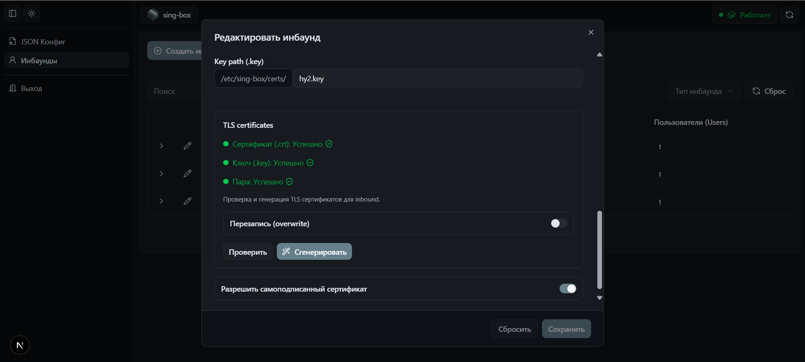

# sing-box-ui

Административная панель для управления конфигурацией sing-box

---

## 🚀 Overview

Веб-интерфейс для управления VPN-конфигурациями sing-box.

Позволяет:

- удобно управлять inbound'ами
- редактировать конфигурацию с валидацией
- генерировать подключения для клиентов (ссылки + QR)

Проект ориентирован на production-подход:
UI управляет реальным running sing-box контейнером через Docker.

---

## 🚀 Highlights

- Full-stack UI для управления sing-box конфигурацией
- Генерация клиентских конфигов (links + QR)
- Автоматическая генерация TLS-сертификатов (self-signed) и ключей (VLESS Reality)
- Schema-based валидация через Zod
- Production-ready CI/CD (GitHub Actions → GHCR → VPS)
- Docker-based deployment (UI + sing-box)
- Интеграция с runtime (управление живым контейнером)

---

## ✨ Features

### 🧩 Config Management

- CRUD для sing-box inbound'ов
- Редактирование raw JSON-конфига
- Schema-based валидация (Zod)
- JSON editor с подсветкой ошибок
- Синхронизация UI и реального конфига

### 🔑 Crypto & Certificates

- Генерация самоподписанных TLS-сертификатов для Hysteria2
- Генерация ключевой пары для VLESS Reality (public/private)

### 🔐 Auth & Security

- JWT auth с HttpOnly cookie

### ⚙️ Runtime Integration

- Применение конфигурации с ручным reload
- Отслеживание статуса применения
- Парсинг и отображение ошибок sing-box
- Интеграция с Docker API через docker.sock

### 📡 Client Access

- Генерация клиентских ссылок (Hysteria2, VLESS и др.)
- Генерация QR-кодов

### 🎨 UI/UX

- Динамические формы (React Hook Form + Zod)
- Light / Dark тема
- Анимированные переходы (`next-view-transitions`)

### 🚀 Infrastructure

- Контейнеризация UI и sing-box через Docker Compose
- CI/CD пайплайн через GitHub Actions + GHCR + SSH-деплой
- Pull-based deployment (сервер не билдит, только запускает)

---

## 🖼 Screenshots

### 🚪 Inbounds management

  <p align="center">
    
  </p>

---

### ✏️ Create / Edit inbound

  <p align="center">
    
  </p>

---

### 🧩 JSON config editor (with validation)

  <p align="center">
    
  </p>

---

## 🧱 Architecture

Проект построен с использованием feature-based архитектуры:

- разделение по доменам (auth, inbound, config)
- строгий public API между фичами
- изоляция бизнес-логики
- shared-слой для UI, утилит и хуков
- минимизация связности между модулями

---

## ⚙️ Tech Stack

- Next.js (App Router)
- React 18
- TypeScript (strict mode)
- Tailwind CSS + shadcn/ui
- React Query
- React Hook Form
- Zod
- Docker
- sing-box

---

## 🐳 Infrastructure

Приложение разворачивается через Docker Compose:

- Next.js UI (frontend)
- sing-box (отдельный контейнер)
- volume для хранения конфигурации

### Подход:

- билд происходит в CI (GitHub Actions)
- образы публикуются в GHCR
- сервер делает только `pull + run`

Это устраняет нагрузку на сервер и делает деплой предсказуемым.

---

## 🧩 Code Quality

- ESLint с архитектурными правилами (feature-based)
- Prettier + EditorConfig
- Husky + lint-staged (pre-commit проверки)

---

## ▶️ Run locally

```bash
docker compose up --build
```
