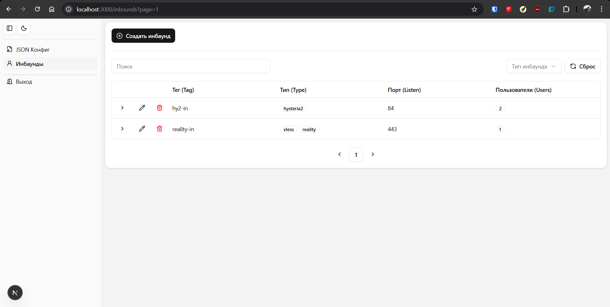
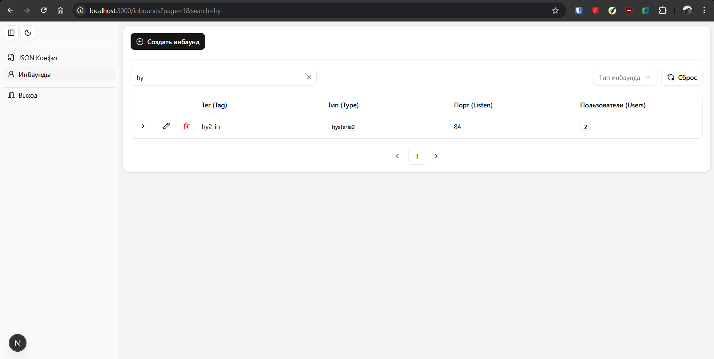
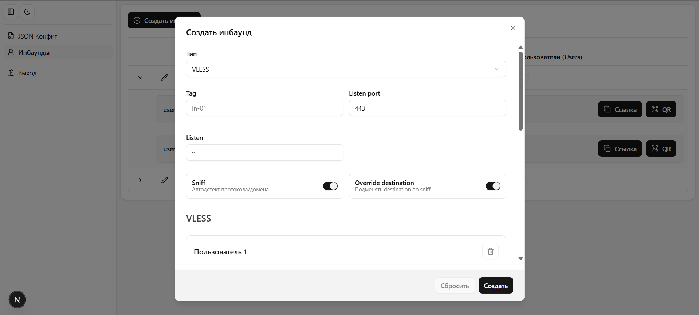
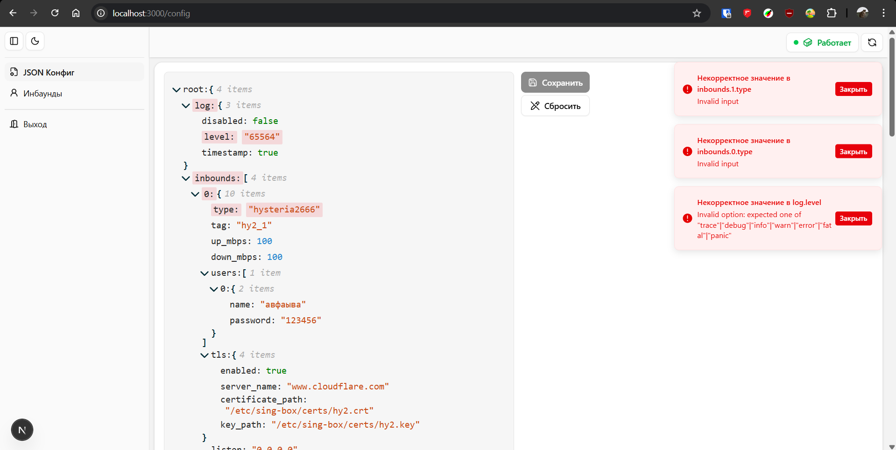
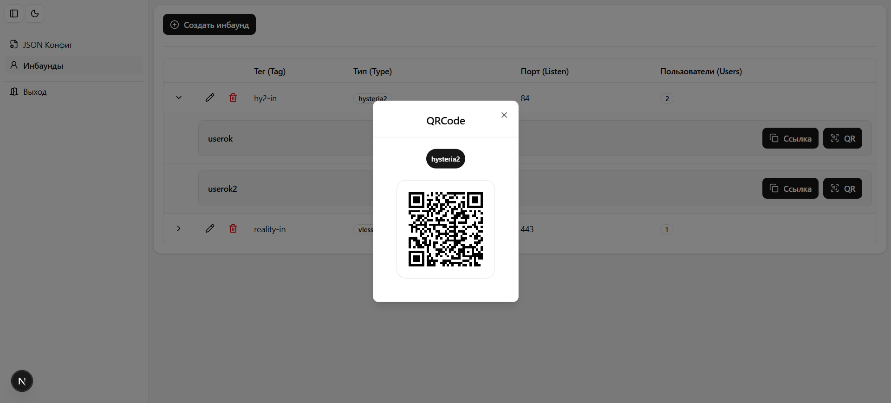

# sing-box-ui

Административная панель для управления конфигурацией sing-box

---

## 🚀 Overview

Веб-интерфейс для управления VPN-конфигурациями sing-box.

Позволяет удобно управлять настройками, редактировать конфигурацию с валидацией
и генерировать подключения для клиентов.

---

## ✨ Features

- CRUD для inbound'ов
- Динамические формы (React Hook Form + Zod)
- Валидация конфигурации sing-box (schema-based)
- JSON editor с подсветкой ошибок
- Генерация QR-кодов и ссылок для клиентов
- JWT авторизация
- Переключение темы (light/dark)
- Feature-based архитектура

---

## 🖼 Screenshots

### 🚪 Inbounds management

<p align="center">
  
  
</p>

---

### ✏️ Create / Edit inbound

<p align="center">
  
</p>

---

### 🧩 JSON config editor (with validation)

<p align="center">
  
</p>

---

### 📱 Client connections (QR / links)

<p align="center">
  
</p>

---

## 🧱 Architecture

Проект построен с использованием feature-based архитектуры:

- разделение по доменам (auth, inbound, config)
- строгий public API между фичами
- изоляция бизнес-логики
- переиспользуемые shared-компоненты

---

## ⚙️ Tech Stack

- Next.js (App Router)
- React 18
- TypeScript (strict)
- Tailwind CSS + shadcn/ui
- React Query
- Zustand
- React Hook Form
- Zod
- Docker
- sing-box

---

## 🐳 Infrastructure

Приложение разворачивается через Docker Compose:

- Next.js UI (frontend)
- sing-box (отдельный контейнер)
- volume для хранения конфигурации

Архитектура приближена к production setup.

---

## 🧩 Code Quality

- ESLint с кастомными правилами для соблюдения feature-based архитектуры
- Prettier + EditorConfig для консистентного форматирования
- Husky + lint-staged (pre-commit проверки)

---

## ▶️ Run locally

```bash
docker compose up --build
```

---

## 📌 Notes

Проект реализован как практическое приложение с упором на:

- архитектуру
- работу с конфигурациями
- продакшн-подход к разработке

---

## 📎 Related

- sing-box: https://github.com/SagerNet/sing-box

---
